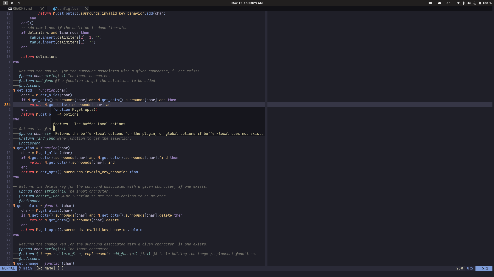

# config.nvim
My Lua configuration for Neovim on Linux (some features work on Windows). I
mainly use this setup for [taking notes](https://github.com/kylechui/latex) and
doing homework in LaTeX, as well as programming in C++.
[Obligatory link to Castel's blog.](https://castel.dev/post/lecture-notes-1/)

## Screenshot

* Font: [JetBrains Mono Nerd
  Font](https://github.com/ryanoasis/nerd-fonts/tree/master/patched-fonts/JetBrainsMono/Ligatures)
  (can be changed in
  [settings](https://github.com/kylechui/config.nvim/blob/f8ed82242dd8b55271ea2f3b453d15b9be8d5df9/lua/settings.lua#L13))
* Colorscheme: Tweaked version of
  [gruvbox-flat](https://github.com/eddyekofo94/gruvbox-flat.nvim)
* GUI: I use [Neovide](https://github.com/neovide/neovide) as my interface of
  choice



## Dependencies
* Requires [Neovim 0.6+](https://github.com/neovim/neovim/releases/tag/v0.6.0)
  for Lua integration
* Requires a PDF reader if you want to view compiled LaTeX documents:
  * Linux: [Zathura](https://pwmt.org/projects/zathura/)
  * Windows:
    [SumatraPDF](https://www.sumatrapdfreader.org/download-free-pdf-viewer)
* Requires Python 3 (and pynvim) for
  [UltiSnips](https://github.com/sirver/UltiSnips)
* [Optional] Requires Node.js and yarn for [live previewing markdown
  files](https://github.com/iamcco/markdown-preview.nvim)
  of choice

## Setup
I use [packer.nvim](https://github.com/wbthomason/packer.nvim) to manage all of
my packages. The general hierarchy for how things are configured is as follows:
```
ftplugin
└── ...
lua
├── keybinds.lua
├── plugins.lua
├── settings.lua
├── utils.lua
└── pluginSettings
    └── ...
└── mySnippets
    └── ...
```
* `ftplugin/` -- Stores various settings for specific file types
* `keybinds.lua` -- Stores various key maps
* `plugins.lua` -- Defines which plugins will be installed
* `settings.lua` -- General settings and options
* `utils.lua` -- Some helper functions
* `pluginSettings` -- A folder full of the configurations needed for each
  individual plugin, stored in the form `pluginSettings/[pluginName].lua`
* `mySnippets.lua` -- My snippets configuration for each language I use, stored
  in the form `mySnippets/[fileType].snippets`

## Todo
* Improve cross-compatibility with Windows

#### Why UltiSnips?
To my knowledge, it is the only snippet manager out there that has convenient
regexp-based snippets *and* auto-expanding snippets. If there is another
snippet manager out there written in Lua or something that has both of the
aforementioned features, I'll consider switching to that.
