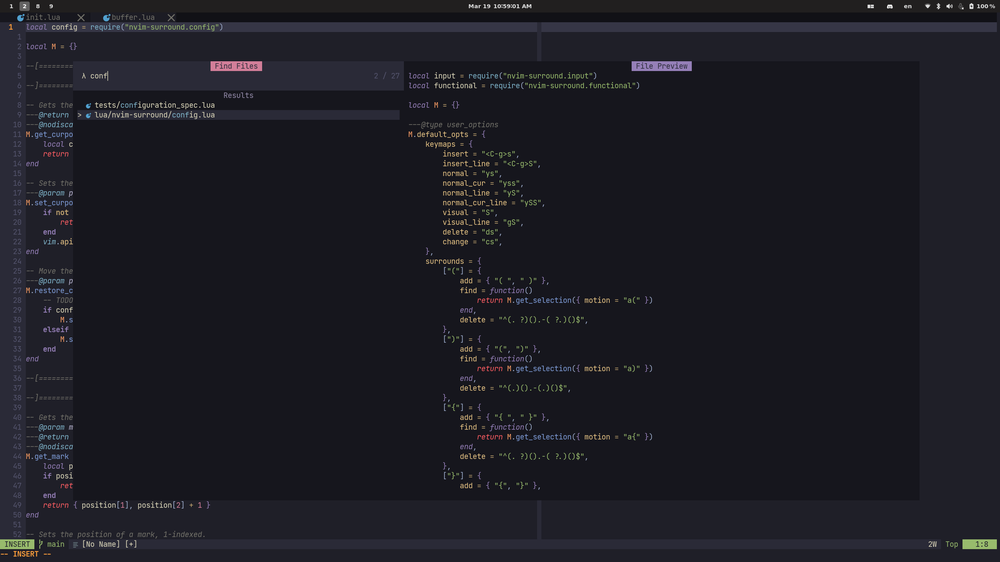

# config.nvim

My Lua configuration for Neovim on Linux (some features work on Windows). I
mainly use this setup for [taking notes](https://github.com/kylechui/latex) and
doing homework in LaTeX, as well as light programming in Lua, OCaml, etc.
[Obligatory link to Castel's blog.](https://castel.dev/post/lecture-notes-1/)

## Screenshot

- Font:
  [JetBrains Mono Nerd Font](https://github.com/ryanoasis/nerd-fonts/tree/master/patched-fonts/JetBrainsMono/Ligatures)
  (can be changed in
  [settings](https://github.com/kylechui/config.nvim/blob/f8ed82242dd8b55271ea2f3b453d15b9be8d5df9/lua/settings.lua#L13))

- Colorscheme: [kanagawa](https://github.com/rebelot/kanagawa.nvim)

- Terminal: I use [WezTerm](https://github.com/wez/wezterm) as my interface of
  choice

 

## Dependencies

- Requires [Neovim 0.8+](https://github.com/neovim/neovim/releases) for Lua
  integration
- Requires a PDF reader if you want to view compiled LaTeX documents:
  - Linux: [Zathura](https://pwmt.org/projects/zathura/)
  - Windows:
    [SumatraPDF](https://www.sumatrapdfreader.org/download-free-pdf-viewer)
- \[Optional] Requires Node.js and yarn for
  [live previewing markdown files](https://github.com/iamcco/markdown-preview.nvim)
  of choice

## Setup

I use [lazy.nvim](https://github.com/folke/lazy.nvim) to manage all of my
packages. The general hierarchy for how things are configured is as follows:

    after
    └── ftplugin
        └── ...
    queries
    └── ...
    lua
    ├── autocommands.lua
    ├── keymaps.lua
    ├── settings.lua
    ├── utils.lua
    └── plugins
        └── ...
    └── luasnippets
        └── ...

- `ftplugin/` -- Stores various settings for specific file types
- `queries/` -- Some scheme files for Tree-sitter parsing that define swappable
  groups, stored in `[fileType]/textobjects.scm`
- `autocommands.lua` -- Defines a few useful autocommands
- `keymaps.lua` -- Stores various key maps
- `settings.lua` -- General settings and options
- `utils.lua` -- Some helper functions
- `plugins/` -- A folder full of the configurations needed for each individual
  plugin
- `luasnippets/` -- My snippets configuration for each language I use, stored in
  the form `luasnippets/[fileType].lua`
